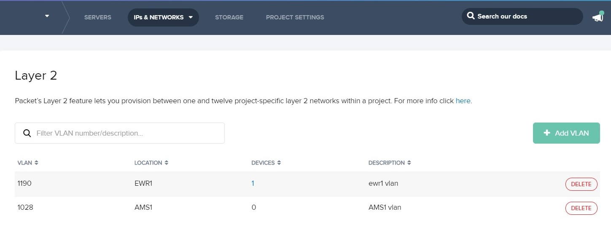
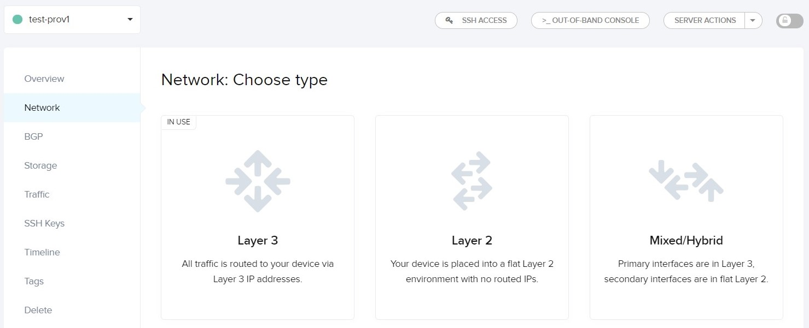
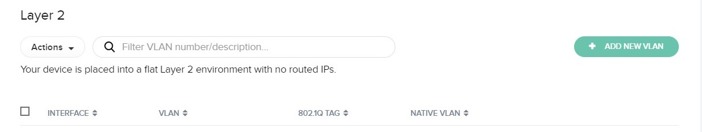
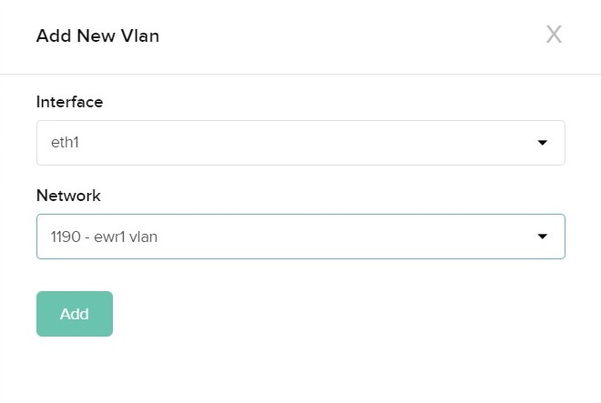

<!-- <meta>
{
    "title":"Layer 2",
    "description":"A quick look at the layer 2 feature.",
    "tag":["layer 2", "networking", "advanced"],
    "seo-title": "Layer 2 Network Topology - Packet Developer Docs",
    "seo-description": "A quick look at the layer 2 feature.",
    "og-title": "Layer 2 Network Topology - Packet Developer Docs",
    "og-description": "A quick look at the layer 2 feature.",
    "og-image": "/images/packet-product-docs.png"
}
</meta> -->

Packet servers are configured with a Layer 3 network configuration by default.

Many bare metal environments benefit from Layer 2 networking to manage services
like DHCP and routing within a private network. To support these use cases we’ve
developed a feature that allows users to add Layer 2 virtual networks to their
Packet infrastructure.

You can attach servers in the same project within the same data center to
numerous Layer 2 virtual networks. This feature is available in all data centers
for no added fee.

### Network configuration types

The server Network page in the Portal offers a configuration panel that makes it
easy to change types.  The network type can also be managed from the
[`device_network_type` resource in the Packet Terraform
provider](https://registry.terraform.io/providers/packethost/packet/latest/docs/resources/device_network_type).

When converting from Layer 3 to another network type there are 3 possible
configurations to choose from:

* Hybrid mode
* Layer 2 - Bonded mode
* Layer 2 - Individual mode

In Hybrid mode, only one network interface is removed from bond and placed in
Layer 2 mode. VLANs can then be attached to this interface for Layer 2
connectivity. This preserves Layer 3 connectivity to the server via bond0, so it
can be accessed via the public IP.  This mode can be used to provide a NAT
gateway, for example.

Layer 2 - Bonded mode converts the bonded network interface to pure Layer 2
mode. This means all access to the public internet is lost, and the host can
only be reached by the [Serial Over SSH (SOS)
console](https://www.packet.com/developers/docs/servers/key-features/sos-serial-over-ssh/).
In this configuration the network bond is intact, so only one network interface
will be available for attaching VLANs.

Layer 2 - Individual mode (also known as a "broken bond mode") is similar to the
Layer 2 - Bonded mode configuration, except the network bond is also dismantled,
thus, providing two network interfaces available for VLANs.

Please note that converting a server to either Layer 2 networking configuration
will permanently remove the server's management IP addresses. When the server is
converted back to Layer 3, new IP addresses will be assigned.

#### Server types

Layer 2 networking features are not available or are limited on some server
types.

* t1.small.x86 and c1.small.x86 servers support Layer 3 only.
* x1.small.x86 servers support Hybrid (Layer 2 + Layer 3) mode only.

## Reverting to Layer 3 from Layer 2

The server networking page in the Portal allows you to revert back to the
default Layer 3 configuration from a Layer 2 configuration.

When changing the network type in this way, the Portal automates the bonding of
network interfaces and assigns new IP addresses.

## Functional Description

On the server configuration screen in the Portal, the switch ports serving each
of your server's NICs may be independently enabled to switch one or more of your
provisioned networks.

If only one VLAN is enabled on a port, packets are untagged. This means that the
server's network configuration does not need to be VLAN-aware. However when two
or more VLANs are enabled on a port, then packets are tagged and therefore it
will be necessary to configure the server's networking accordingly.

## Layer 2 Setup in the Packet Portal

Layer 2 networking is enabled in the Packet Portal from the project's "IPs and
Networks" tab.

Under "Layer 2" you can add one or more networks like this:

Note that networks are local to a specific data center and that the assigned
VLAN ID displayed here will be used to configure server port switching and
server network setup.

When you add a network, we automatically provision it in our data center
switches; however, in order for it to be made available to individual machines
additional steps are required.

1. Convert the server's networking mode. This will configure the server to allow
   attachment of your server's network interfaces to your VLAN. You can choose a
   mix/hybrid pure Layer 2 (with the option to break the bond or leave it
   intact).

   

1. Once the network mode has been changed you will see the option to attach a
   new VLAN.

   

1. Choose the network interface you wish to attach the VLAN to, but be aware
   that you should only choose "bond0" if you have converted the server to the
   bonded layer 2 networking mode.

   
